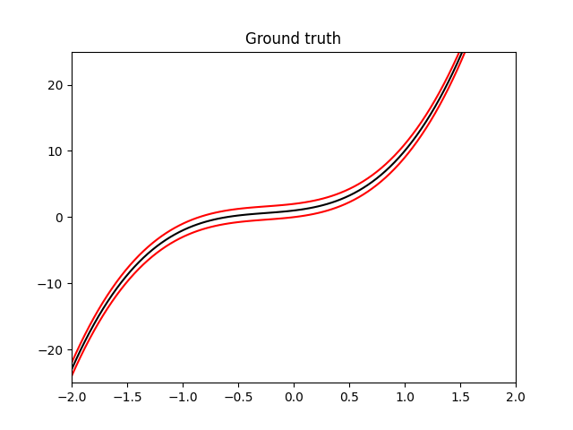
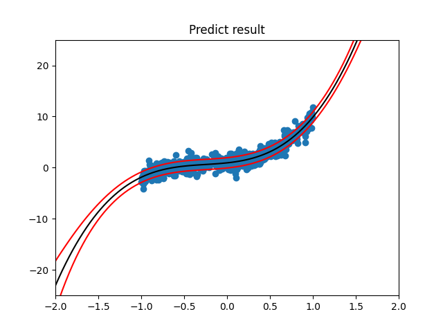
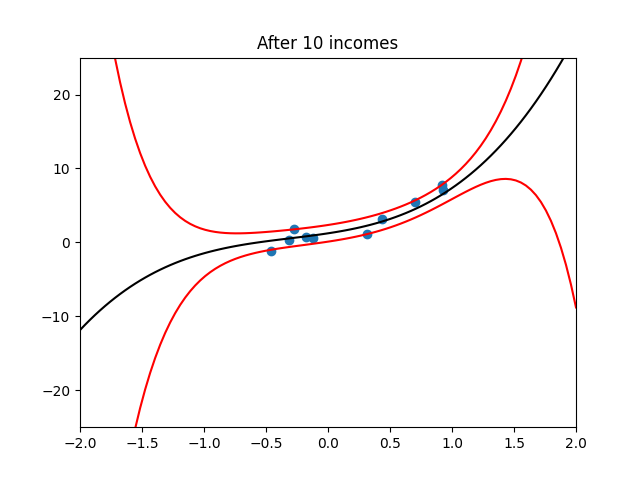
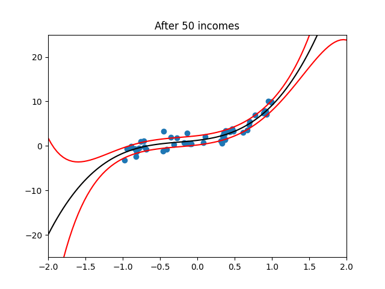

# Homework 3

- Spec: [1091ML_HW03.pdf](./1091ML_HW03.pdf)

## Prerequisites

Python 3.6^ involving following packages:

- `numpy`
- `matplotlib`

## Usage

### 1. Random Data Generator

```txt
$ python3 HW03_1_RandomDataGenerator.py --help
usage: HW03_1_RandomDataGenerator.py [-h] [--weights WEIGHTS [WEIGHTS ...]]
                                     mean var n

positional arguments:
  mean                  mean of the normal distribution
  var                   variance of the normal distribution (the value is
                        shared as `a` for 1.b)
  n                     degree of the polynoimal space

optional arguments:
  -h, --help            show this help message and exit
  --weights WEIGHTS [WEIGHTS ...]
```

For example,

```txt
$ python3 HW03_1_RandomDataGenerator.py 1 10 3 --weights 1 2 3
a. -1.0859605063900477
b. -0.4422366907396871
```

### 2. Sequential Estimator

```txt
$ python3 HW03_2_SequentialEstimator.py --help
usage: HW03_2_SequentialEstimator.py [-h] mean var

positional arguments:
  mean        mean of the normal distribution
  var         variance of the normal distribution (the value is shared as `a`
              for 1.b)

optional arguments:
  -h, --help  show this help message and exit
```

For example,

```txt
python3 HW03_2_SequentialEstimator.py 3 5
Data point source function: N(3.0, 5.0)

Add data point: 4.38471
Mean = 4.20409   Variance = 0.06525
Add data point: 2.77296
Mean = 3.72704   Variance = 0.71534
Add data point: 4.00614
Mean = 3.79682   Variance = 0.49636
...
Add data point: 4.77251
Mean = 2.89661   Variance = 4.83613
```

### 3. Baysian Linear Regression

```txt
$ python3 HW03_3_BaysianLinearRegression.py --help
usage: HW03_3_BaysianLinearRegression.py [-h]
                                         [--weights WEIGHTS [WEIGHTS ...]]
                                         b n var

positional arguments:
  b                     the precision for the initial prior
  n                     degree of the polynoimal space
  var                   variance of the normal distribution (the value is
                        shared as `a` for 1.b)

optional arguments:
  -h, --help            show this help message and exit
  --weights WEIGHTS [WEIGHTS ...]
```

For example,

```txt
$ python3 HW03_3_BaysianLinearRegression.py 1 4 1 --weights 1 2 3 4
(1) Add data point (-0.94177, -1.30793):

Posterior mean:
 [-0.29921027  0.28178718 -0.26537865  0.24992558]

Posterior variance:
 [[ 0.7712338   0.21544509 -0.20289967  0.19108477]
 [ 0.21544509  0.79710033  0.19108477 -0.17995786]
 [-0.20289967  0.19108477  0.82004214  0.16947887]
 [ 0.19108477 -0.17995786  0.16947887  0.84038993]]

Predictive distribution ~ N(-1.00872, 1.77123)
--------------------------------------------------------------
(2) Add data point (-0.88175, -1.24794):

Posterior mean:
 [-0.35592468  0.32356149 -0.29445902  0.26826466]

Posterior variance:
 [[ 0.71980912  0.25332313 -0.22926773  0.20771337]
 [ 0.25332313  0.76920039  0.21050678 -0.19220604]
 [-0.22926773  0.21050678  0.80652189  0.1780052 ]
 [ 0.20771337 -0.19220604  0.1780052   0.83501293]]

Predictive distribution ~ N(-1.05406, 1.39903)
--------------------------------------------------------------
...
--------------------------------------------------------------
(279) Add data point (-0.86446, -1.00645):

Posterior mean:
 [1.03012742 2.17194424 2.99834073 3.71124018]

Posterior variance:
 [[ 8.08774064e-03  2.84040759e-04 -1.29417883e-02 -1.03602297e-04]
 [ 2.84040759e-04  5.84409117e-02  2.04367902e-03 -7.91877561e-02]
 [-1.29417883e-02  2.04367902e-03  3.73984537e-02 -1.58436431e-03]
 [-1.03602297e-04 -7.91877561e-02 -1.58436431e-03  1.30229169e-01]]

Predictive distribution ~ N(-1.00426, 1.01774)
```

| Ground truth                       | Predict result                     |
| ---------------------------------- | ---------------------------------- |
|      |    |
| **After 10 incomes**               | **After 50 incomes**               |
|  |  |
