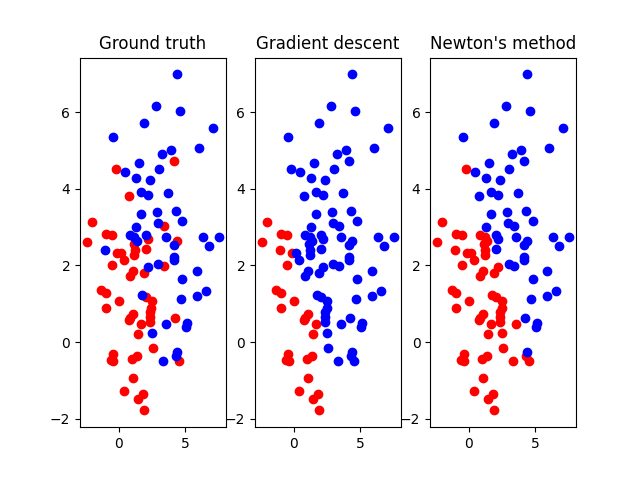

# Homework 4

- Spec: [1091ML_HW04.pdf](./1091ML_HW04.pdf)

## Prerequisites

Python 3.6^ involving following packages:

- `numpy`
- `scipy`
- `matplotlib`

## Usage

### 1. Logistic regression

```txt
$ python3 HW04_1_LogisticRegression.py --help
usage: HW04_1_LogisticRegression.py [-h] N mx1 vx1 my1 vy1 mx2 vx2 my2 vy2

positional arguments:
  N           number of data points
  mx1         mean of x1
  vx1         variance of x1
  my1         mean of y1
  vy1         variance of y1
  mx2         mean of x2
  vx2         variance of x2
  my2         mean of y2
  vy2         variance of y2

optional arguments:
  -h, --help  show this help message and exit
```

For example,

```txt
$ python3 HW04_1_LogisticRegression.py 50 1 2 1 2 3 4 3 4

--------------------------------------------------------------

Gradient descent:

w: [-8.15200675  2.60701024  2.56111335]

Confusion matrix:
             Predict cluster 1  Predict cluster 2
Is cluster 1                34                 16
Is cluster 2                 9                 41

Sensitivity (Successfully predict cluster 1): 0.68000
Specificity (Successfully predict cluster 2): 0.82000

--------------------------------------------------------------

Newton's method:

w: [-2.1883581   0.59041235  0.55327979]

Confusion matrix:
             Predict cluster 1  Predict cluster 2
Is cluster 1                38                 12
Is cluster 2                12                 38

Sensitivity (Successfully predict cluster 1): 0.76000
Specificity (Successfully predict cluster 2): 0.76000
```



### 2. EM Algorithm

```txt
$ python3 HW04_2_EM_Algorithm.py --help
usage: HW04_2_EM_Algorithm.py [-h] [--nocache] [--debug]

optional arguments:
  -h, --help  show this help message and exit
  --nocache   do not use pickle as cache feature
  --debug     show debugging message
```

For example,

```txt
$ python3 HW04_2_EM_Algorithm.py
------------------------------------------------------------
...
------------------------------------------------------------

Confusion Matrix 0:
                 Predict number 0  Predict not number 0
    Is number 0              4565                  1358
 Isn't number 0               277                 53800

Sensitivity (Successfully predict number 0)    : 0.770724
Specificity (Successfully predict not number 0): 0.994878

------------------------------------------------------------


Confusion Matrix 1:
                 Predict number 1  Predict not number 1
    Is number 1              6097                   645
 Isn't number 1              1015                 52243

Sensitivity (Successfully predict number 1)    : 0.904331
Specificity (Successfully predict not number 1): 0.980942

------------------------------------------------------------

...

------------------------------------------------------------


Confusion Matrix 9:
                 Predict number 9  Predict not number 9
    Is number 9              2550                  3399
 Isn't number 9              4431                 49620

Sensitivity (Successfully predict number 9)    : 0.428643
Specificity (Successfully predict not number 9): 0.918022

------------------------------------------------------------

Total iteration to converge: 26
Total error rate: 0.424967
```
