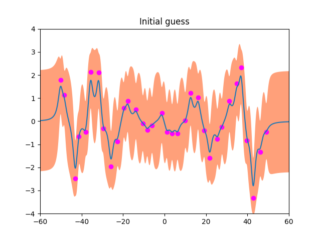
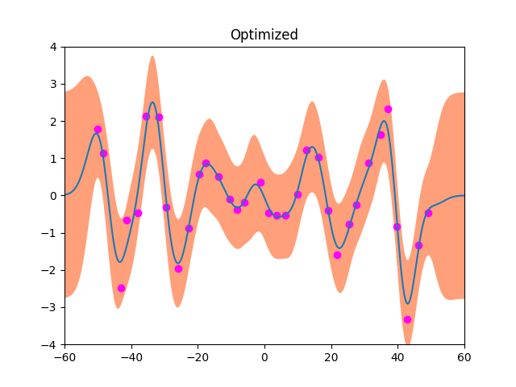
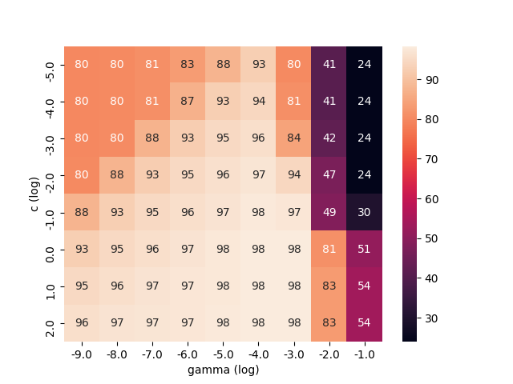

# Homework 5

- Spec: [ML_HW05-1_Spec.pdf](./ML_HW05-1_Spec.pdf), [ML_HW05-2_Spec.pdf](./ML_HW05-2_Spec.pdf)
- Written Report: [ML_HW5-1_report.pdf](./ML_HW5-1_report.pdf), [ML_HW5-2_report.pdf](./ML_HW5-2_report.pdf)

## Prerequisites

Python 3.6^ involving following packages:

- `numpy`
- `scipy`
- `matplotlib`
- `seaborn`
- `libsvm` (embedded in this project, use `git submodule update --init --recursive` if folder is empty)

## Usage

### 1. Gaussian Process

```txt
$ python3 HW05_1_GaussianProcess.py
```

| Initial guess                   | Optimized result            |
| ------------------------------- | --------------------------- |
|  |  |

### 2. SVM

```txt
$ python3 HW05_2_SVM.py --help
usage: HW05_2_SVM.py [-h] [--disable-part1] [--disable-part2]
                     [--disable-part3]

optional arguments:
  -h, --help       show this help message and exit
  --disable-part1
  --disable-part2
  --disable-part3
```

For example,

```txt
$ python3 HW05_2_SVM.py --disable-part1 --disable-part3
```

| Part 2                |
| --------------------- |
|  |
