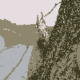
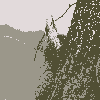
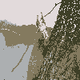

# Homework 6

- Spec: [ML_HW06.pdf](./ML_HW06.pdf)
- Written Report: [ML_HW6_report.pdf](./ML_HW6_report.pdf)

## Prerequisites

Python 3.6^ involving following packages:

- `numpy`
- `scipy`
- `matplotlib`
- `imageio`

## Usage

### 1. Kernel K-Means

```txt
$ python3 HW06_KernelKMeans.py --help
usage: HW06_KernelKMeans.py [-h] [--debug] filename k init

positional arguments:
  filename    path to image file
  k           number of clusters
  init        methods of initialization

optional arguments:
  -h, --help  show this help message and exit
  --debug     show debug message
```

|                            | image1.png $(\gamma_c, \gamma_s) = (10^{-4}, 10^{-3})$                                                                | image2.png $(\gamma_c, \gamma_s) = (10^{-4}, 10^{-3})$                                                                |
| -------------------------- | --------------------------------------------------------------------------------------------------------------------- | --------------------------------------------------------------------------------------------------------------------- |
| **Original image**         |                                                                            |                                                                            |
| **2 Clusters (random)**    | [](images/image1_2_random_kkm_result.gif)       | [](images/image2_2_random_kkm_result.gif)       |
| **2 Clusters (K-Means++)** | [](images/image1_2_k-means++_kkm_result.gif) | [](images/image2_2_k-means++_kkm_result.gif) |
| **3 Clusters (random)**    | [](images/image1_3_random_kkm_result.gif)       | [](images/image2_3_random_kkm_result.gif)       |
| **3 Clusters (K-Means++)** | [](images/image1_3_k-means++_kkm_result.gif) | [](images/image2_3_k-means++_kkm_result.gif) |
| **4 Clusters (random)**    | [](images/image1_4_random_kkm_result.gif)       | [](images/image2_4_random_kkm_result.gif)       |
| **4 Clusters (K-Means++)** | [](images/image1_4_k-means++_kkm_result.gif) | [](images/image2_4_k-means++_kkm_result.gif) |

### 2. Spectral Clustering

```txt
$ python3 HW06_SpectralClustering.py --help
usage: HW06_SpectralClustering.py [-h] [--debug] [--cache] [--save-cache]
                                  filename k mode init

positional arguments:
  filename      path to image file
  k             number of clusters
  mode          clustering mode
  init          methods of initialization

optional arguments:
  -h, --help    show this help message and exit
  --debug       show debug message
  --cache       use cached eigenvalues and eigenvectors
  --save-cache  use cached eigenvalues and eigenvectors
```

|                                       | image1.png $(\gamma_c, \gamma_s) = (10^{-4}, 10^{-3})$                                                                                        | image2.png $(\gamma_c, \gamma_s) = (10^{-4}, 10^{-3})$                                                                                        |
| ------------------------------------- | --------------------------------------------------------------------------------------------------------------------------------------------- | --------------------------------------------------------------------------------------------------------------------------------------------- |
| **Original image**                    |                                                                                                    |                                                                                                    |
| **2 Clusters (Ratio-Cut, random)**    | [](images/image1_2_random_unnormalized_sc_result.gif)       | [](images/image2_2_random_unnormalized_sc_result.gif)       |
| **2 Clusters (N-Cut, random)**        | [](images/image1_2_random_normalized_sc_result.gif)           | [](images/image2_2_random_normalized_sc_result.gif)           |
| **2 Clusters (Ratio-Cut, K-Means++)** | [](images/image1_2_k-means++_unnormalized_sc_result.gif) | [](images/image2_2_k-means++_unnormalized_sc_result.gif) |
| **2 Clusters (N-Cut, K-Means++)**     | [](images/image1_2_k-means++_normalized_sc_result.gif)     | [](images/image2_2_k-means++_normalized_sc_result.gif)     |
| **3 Clusters (Ratio-Cut, random)**    | [](images/image1_3_random_unnormalized_sc_result.gif)       | [](images/image2_3_random_unnormalized_sc_result.gif)       |
| **3 Clusters (N-Cut, random)**        | [](images/image1_3_random_normalized_sc_result.gif)           | [](images/image2_3_random_normalized_sc_result.gif)           |
| **3 Clusters (Ratio-Cut, K-Means++)** | [](images/image1_3_k-means++_unnormalized_sc_result.gif) | [](images/image2_3_k-means++_unnormalized_sc_result.gif) |
| **3 Clusters (N-Cut, K-Means++)**     | [](images/image1_3_k-means++_normalized_sc_result.gif)     | [](images/image2_3_k-means++_normalized_sc_result.gif)     |
| **4 Clusters (Ratio-Cut, random)**    | [](images/image1_4_random_unnormalized_sc_result.gif)       | [](images/image2_4_random_unnormalized_sc_result.gif)       |
| **4 Clusters (N-Cut, random)**        | [](images/image1_4_random_normalized_sc_result.gif)           | [](images/image2_4_random_normalized_sc_result.gif)           |
| **4 Clusters (Ratio-Cut, K-Means++)** | [](images/image1_4_k-means++_unnormalized_sc_result.gif) | [](images/image2_4_k-means++_unnormalized_sc_result.gif) |
| **4 Clusters (N-Cut, K-Means++)**     | [](images/image1_4_k-means++_normalized_sc_result.gif)     | [](images/image2_4_k-means++_normalized_sc_result.gif)     |
