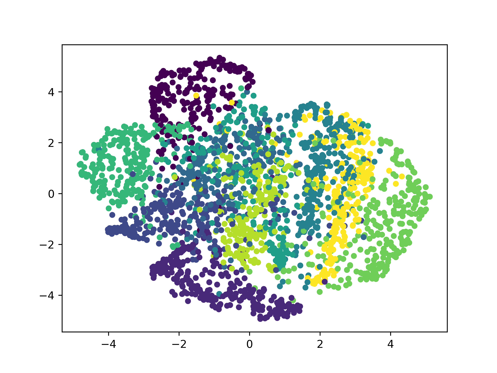
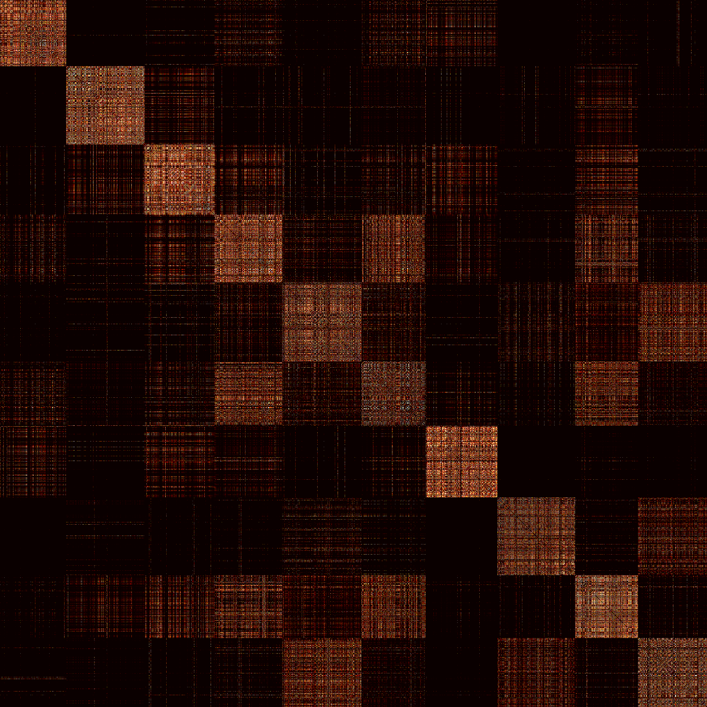

# Homework 7

- Student ID: 309553002
- Name: 林育愷

## Prerequisites

Python 3.6^ involving following packages:

- `numpy`
- `scipy`
- `matplotlib`

## Usage

### 1. Kernel Eigenfaces

```txt
$ python3 HW07_1_KernelEigenFaces.py --help
usage: HW07_1_KernelEigenFaces.py [-h] [--enable-part-1] [--enable-part-2]
                                  [--enable-part-3] [--debug]

optional arguments:
  -h, --help       show this help message and exit
  --enable-part-1
  --enable-part-2
  --enable-part-3
  --debug
```

| Eigenfaces                                                   | Fisherfaces                                                    |
| ------------------------------------------------------------ | -------------------------------------------------------------- |
|                          |                          |
| **Reconstruction of eigenfaces**                             | **Reconstruction of fisherfaces**                              |
|  |  |

| k   | PCA       | LDA       | Linear Kernel PCA | Linear Kernel LDA | Polynomial Kernel PCA $(c, d) = (1, 2)$ | Polynomial Kernel LDA $(c, d) = (1, 2)$ | RBF Kernel PCA $\gamma=10^{-3}$ | RBF Kernel LDA $\gamma=10^{-3}$ |
| --- | --------- | --------- | ----------------- | ----------------- | --------------------------------------- | --------------------------------------- | ------------------------------- | ------------------------------- |
| 3   | **96.67** | 63.33     | 83.33             | 86.67             | 83.33                                   | 86.67                                   | 83.33                           | 86.67                           |
| 5   | **96.67** | 70        | 83.33             | **90**            | **86.67**                               | **90**                                  | 80                              | 86.67                           |
| 7   | **96.67** | **73.33** | 80                | 86.67             | 83.33                                   | 86.67                                   | 80                              | 86.67                           |
| 9   | **96.67** | 66.67     | 83.33             | 83.33             | 83.33                                   | 86.67                                   | 83.33                           | 86.67                           |
| 11  | **96.67** | 66.67     | **86.67**         | 86.67             | **86.67**                               | 86.67                                   | **86.67**                       | 86.67                           |
| 13  | **96.67** | 66.67     | 80                | 86.67             | 76.67                                   | 86.67                                   | 76.67                           | **90**                          |
| 15  | **96.67** | 63.33     | 80                | 83.33             | 76.67                                   | 86.67                                   | 80                              | **90**                          |

### 2. t-SNE

You can run single task (one perplexity value) using the following command:

```txt
$ python3 HW07_2_tSNE.py --help
usage: HW07_2_tSNE.py [-h] [--enable-part-1] [--enable-part-2]
                      [--enable-part-3] [--debug]
                      perplexity

positional arguments:
  perplexity

optional arguments:
  -h, --help       show this help message and exit
  --enable-part-1
  --enable-part-2
  --enable-part-3
  --debug
```

Or you are free to use `script.py` to run several tasks:

```txt
python3 script.py
```

|                   | t-SNE                                                | Symmetric SNE                                        |
| ----------------- | ---------------------------------------------------- | ---------------------------------------------------- |
| **perplexity=05** | [](images/tsne_5.gif)    | [](images/ssne_5.gif)    |
| **perplexity=10** | [](images/tsne_10.gif) | [](images/ssne_10.gif) |
| **perplexity=15** | [](images/tsne_15.gif) | [](images/ssne_15.gif) |
| **perplexity=20** | [](images/tsne_20.gif) | [](images/ssne_20.gif) |
| **perplexity=25** | [](images/tsne_25.gif) | [](images/ssne_25.gif) |
| **perplexity=30** | [](images/tsne_30.gif) | [](images/ssne_30.gif) |

|                   | t-SNE High Dimension Pairwise Similarities | t-SNE Low Dimension Pairwise Similarities | Symmetric SNE High Dimension Pairwise Similarities | Symmetric SNE Low Dimension Pairwise Similarities |
| ----------------- | ------------------------------------------ | ----------------------------------------- | -------------------------------------------------- | ------------------------------------------------- |
| **perplexity=05** |             |            |                     |                    |
| **perplexity=10** |           |          |                   |                  |
| **perplexity=15** |           |          |                   |                  |
| **perplexity=20** |           |          |                   |                  |
| **perplexity=25** |           |          |                   |                  |
| **perplexity=30** |           |          |                   |                  |
